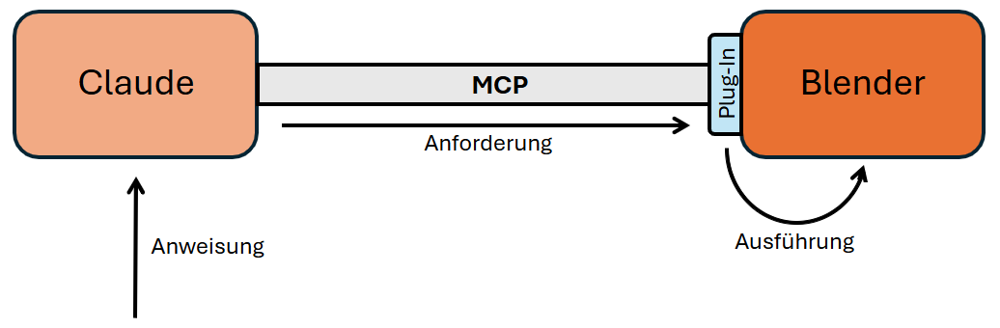

# Ziele der Laborübung

- Grundverständnis: Was sind Blender und UV? Wie funktioniert MCP?
- Wie man über Prompts einfache 3D-Objekte erstellt und verändert.
- Automatische Generierung eines Bilds in Blender, z. B.:

```
Prompt: Erstelle mit Blender über MCP eine stilisierte Low-Poly-3D-Szene eines winterlichen Dorfes bei Nacht.

Wichtig: Kein Rendern, kein Screenshot, kein Export – die Szene soll nur in der 3D-Ansicht aufgebaut werden.

Stil: Low-Poly mit wenigen Polygonen, klaren geometrischen Grundformen, einfarbigen Materialien und ohne Texturen.

Szene: In der Mitte steht ein Weihnachtsbaum aus mehreren gestapelten Kegeln in dunklem Grün, oben ein leuchtender Stern oder eine Kugel mit Emission sowie ein schwaches Point Light. Um den Baum herum befinden sich 5–8 Hütten (Würfelbasis, Kegeldach, braune Farbtöne), 3–5 Marktstände mit einfachen Formen und kleinen farbigen Würfeln als Geschenke sowie 4–6 Laternen aus Zylindern und Würfeln mit warmem orangefarbenem Point Light. Der Boden ist eine große, leicht bläulich-weiße Plane als Schnee, ergänzt durch leichten Schneefall über ein Particle System mit kleinen weißen Partikeln.

Umgebung: Dezente Grundbeleuchtung mit weichen Schatten, warmes Licht bei Laternen, Kamera leicht erhöht und schräg auf die Szene gerichtet, dunkelblauer Nachthimmel mit ruhiger winterlicher Atmosphäre.

Technik: Verwende ausschließlich bpy-Python-Befehle, nur primitive Meshes (Cube, Cone, Cylinder, Sphere), geringe Polygonanzahl und klar strukturierte Funktionen (z. B. create_tree(), create_house(), create_lamp()).
```

# Erklärung der benutzten Technologien

## Blender

Blender ist ein freies, quelloffenes 3D-Produktionswerkzeug, mit dem sich Animationen, Modelle, Simulationen und visuelle Effekte erstellen lassen. Die Vorteile von Blender gegenüber proprietären Lösungen liegen vor allem in der offenen Erweiterbarkeit, der aktiven Community sowie der breiten Plattformunterstützung (Linux, Windows, macOS).  
Die Software integriert zahlreiche Funktionen – von Modellierung, Texturierung und Rigging über Compositing bis hin zu Video-Editing – und besitzt eine leistungsfähige Python-Schnittstelle, über die externe Systeme (wie KI-Modelle) direkt mit Blender interagieren können.

## MCP (Model Context Protocol)

Das Model Context Protocol ist ein offener Standard, der KI-Modellen eine einheitliche, sichere Kommunikation mit externen Datenquellen, Tools und Anwendungen ermöglicht. MCP ist dabei transportagnostisch, d. h. es kann über beliebige Kommunikationskanäle betrieben werden, solange Nachrichten strikt im JSON-RPC-Format übertragen und die Lebenszyklusregeln des Protokolls eingehalten werden.  
Eine MCP-Anwendung besteht grundsätzlich aus zwei Komponenten: einem **MCP-Server**, der Funktionen oder Ressourcen bereitstellt (in unserem Fall: Blender), und einem **MCP-Client**, der eine Verbindung herstellt, die verfügbaren Fähigkeiten ermittelt und die angebotenen Werkzeuge nutzt, um Aktionen auszuführen oder Antworten zu generieren.

## UV

[uv](https://docs.astral.sh/uv/ "abgerufen am 2025-11-11") ist ein Python-Projekt- und Paketmanagement-Tool von Astral. Es kann Dinge wie pip (installiert Python-Pakete) und venv (erstellt eine isolierte Python-Umgebung) und ist auch noch deutlich schneller. \
Bei der Installation von uv werden zusätzlich zum Haupt-Tool noch zwei weitere Tools installiert:

- uvx.exe: startet Python basierte Tools direkt ohne manuelle Installation
- uvw.exe: ist ein weiteres Zusatztool, welches allerdings nur selten gebraucht wird (zB für WebAssembly)

Um in Claude Python-basierte Erweiterungen auszuführen, wie zum Beispiel MCP-Server zu starten, benötigen wir uv beziehungsweise uvx.

## Kommunikation zwischen MCP-Client und Blender-MCP-Server

Der Austausch zwischen Client und Blender erfolgt über einen bidirektionalen Kommunikationskanal – typischerweise **stdio** (Subprozess mit stdin/stdout), **Streamable HTTP** oder wie in unserem Fall **TCP-Socket**.

Die grundlegenden Schritte sind wie folgt:

1. **Initialisierung**  
   Blender wird gestartet, das MCP-Addon aktiviert, und der über das Addon integrierte MCP-Server geht in den Bereitschaftsmodus, um eingehende Verbindungen anzunehmen.

2. **Verbindungsaufbau**  
   Der MCP-Client verbindet sich über den gewählten Transport (stdio oder HTTP-Stream) mit dem Server.

3. **Discovery (Fähigkeitenabfrage)**  
   Der Client ermittelt, welche Ressourcen und Tools das Blender-MCP-Addon bereitstellt – etwa `create_primitive`, `set_object_property` oder `execute_blender_code`.

4. **Ausführung von Befehlen**  
   Der Client sendet JSON-RPC-Requests an den Server; das Addon führt die gewünschten Aktionen innerhalb von Blender aus.

5. **Antwortübermittlung**  
   Der Server liefert standardisierte JSON-RPC-Antworten zurück, beispielsweise Objekt-IDs oder Statusmeldungen.

6. **Folgeaktionen**  
   Basierend auf den Ergebnissen kann der Client weitere Operationen durchführen, etwa Materialien ändern, Szeneneinstellungen anpassen oder komplexe Automationen orchestrieren.


# Installation der benötigten Ressourcen

## Vorbereitende Arbeiten

### Installation von Blender

Auf dem Schulrechner ist Blender bereits installiert. \
Sollten Sie die Übung auf Ihrem privaten Gerät durchführen und Blender noch nicht installiert haben, können sie dies entweder über die Blender [Homepage](https://www.blender.org/download/ "abgerufen am 2025-11-25") tun, oder mit winget:
```ps1
winget install BlenderFoundation.Blender
```


### Installation von uv

Öffnen Sie ein PowerShell-Fenster und führen Sie diesen Befehl aus:

```ps1
powershell -c "irm https://astral.sh/uv/install.ps1 | iex"
```

`irm`...Invoke-RestMethod (lädt ein Skript aus dem Internet herunter) \
`iex`...Invoke-Expression (führt den geladenen Code sofort aus)

**Sollten Sie auf Ihrem privaten PC arbeiten, kommt oft nach diesem Befehl ein Fehler wie dieser:**

```ps1
Error: PowerShell requires an execution policy in [Unrestricted, RemoteSigned, Bypass] to run uv. For example, to set the execution policy to 'RemoteSigned' please run:
Set-ExecutionPolicy RemoteSigned -scope CurrentUser
```

Dieser Fehler bedeutet, dass die PowerShell das Ausführen von Skripten blockiert.
Das können Sie umgehen, indem Sie die Ausführungsrichtlinien für Ihren aktuellen User ändern:

```ps1
Set-ExecutionPolicy RemoteSigned -scope CurrentUser
```

Wenn Sie daraufhin gefragt werden, ob Sie die Ausführungsrichtlinie ändern wollen, antworten Sie mit `J`.\
**_Vergessen Sie nicht die Richtlinien am Ende der Übung wieder zu ändern!_**

```ps1
Set-ExecutionPolicy -Scope CurrentUser -ExecutionPolicy Undefined
```

### uv zum PATH hinzufügen

Damit uv und uvx überall gestartet werden kann, muss der Ordner zum PATH hinzugefügt werden. Dafür gibt es zwei Optionen:

1. Die PowerShell neustarten – die Änderungen werden dann automatisch aktiv.
2. Den Pfad direkt über die PowerShell setzen (Ersetzen Sie `DEIN_USER` mit ihrem Benutzerkonto):

```ps1
$env:Path = "C:\Users\DEIN_USER\.local\bin;$env:Path"
```

**Für diese Laborübung verwenden Sie bitte die zweite Option.**

## Installation und Konfiguration von Claude Desktop

### Claude Desktop Installation

Installieren Sie Claude Desktop über die [Homepage](https://www.claude.com/download "abgerufen am 2025-11-18"), oder über die PowerShell:
```ps1
winget install Anthropic.Claude
```

### Bearbeitung der Konfigurationsdatei

Danach navigieren Sie zu Hamburgermenü → File → Settings → Developer → Edit Config `claude_desktop_config.json` und fügen Sie folgende Zeilen hinzu:

```json
{
  "mcpServers": {
    "blender": {
      "command": "uvx.exe",
      "args": ["--python", "3.12", "blender-mcp"]
    }
  }
}
```

(Ersetzen Sie DEIN_USER mit ihrem Benutzerkonto) \
Mit dieser Konfiguration wird festgelegt, dass Claude uvx.exe mit dem Tool blender-mcp starten muss, um mit Blender zu kommunizieren.

## Installation des Blender-MCP Add-ons

Damit Blender mit Claude kommunizieren kann, braucht Blender selbst auch ein Plug-In.

1. Laden Sie die Datei `addon.py` über folgenden Link herunter: [https://github.com/ahujasid/blender-mcp/blob/main/addon.py](https://github.com/ahujasid/blender-mcp/blob/main/addon.py "abgerufen am 2025-11-25")
   
   Alternativ können Sie die Datei mit PowerShell herunterladen:
   ```ps1
   Invoke-WebRequest https://raw.githubusercontent.com/ahujasid/blender-mcp/refs/heads/main/addon.py -OutFile ~/Downloads/addon.py
   ```
3. Öffnen Sie Blender und Navigieren Sie zu Add-ons (Edit → Preferences → Add-ons)
4. Drücken sie oben rechts auf den Pfeil
5. Klicken Sie auf "Install from Disk..." und wählen Sie `addon.py` aus.
6. Aktivieren Sie das Add-on indem Sie die Checkbox neben "Blender MCP" auswählen.

## Verbindung mit dem Server herstellen

Öffnen Sie Blender und das MCP-Panel, indem Sie rechts oben im Blender-Fenster auf den kleinen Pfeil neben dem Orbit-Gizmo (Achsenansicht) klicken. \
Dort befindet sich im Unterpunkt **„BlenderMCP“** der Button **„Connect to MCP server“**. Klicken Sie auf diesen.
Damit sich Claude mit dem von Blender gestarteten Server verbindet, müssen Sie Claude Desktop neu starten.
Überprüfen Sie mithilfe des Task-Managers, ob das Programm wirklich geschlossen wurde.

# Praxisphase

## Erste Tests

Überprüfen Sie unten links über das Plus-Symbol, ob der Connector **„Blender“** aktiviert ist.

Überlegen Sie sich einen kreativen Prompt und senden Sie ihn ab!

Verwenden Sie dann Prompt-Verkettung: Geben Sie den Prompt an eine andere KI weiter, mit der Aufgabe, einen guten Prompt für Claude Desktop zu erstellen, und vergleichen Sie, wie erfolgreich die beiden 3D-Modelle geworden sind.

Dokumentieren Sie die Ausgaben mittels Screenshots.

## Reflexion

1. Welche Arbeiten könnte Ihnen MCP in Zukunft abnehmen?
2. Würden Sie MCP in Zukunft selbst verwenden, wieso bzw. wieso nicht?


---

*Viel Erfolg! ;\)*

